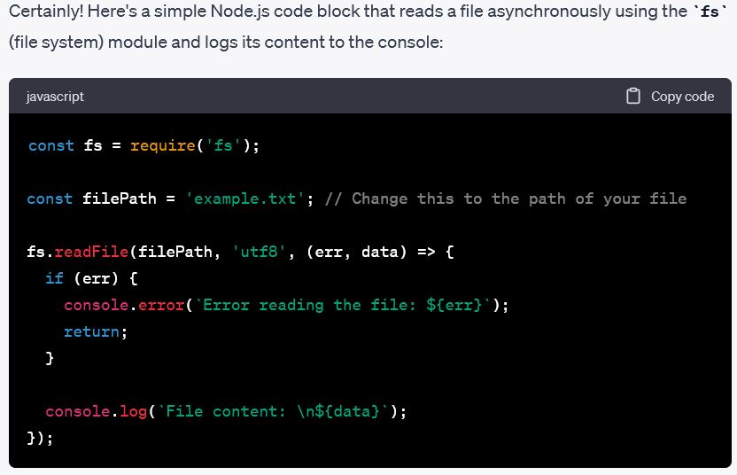

# GitHub Docs Example
This is a part of Andrew Brown's Terratown Project

## Step 1 - Using Codeblocks. 

Codeblocks in markdown make it *very easy* for tech people to **copy, paste, and share** code. 
A good __Cloud Engineer__ uses Codeblocks whenever possible. 

Because it allows others to copy and paste their code to replicate or research issues. 

- In order to create codeblocks in markdown you need to use three backticks (`)
- Not to be confused with single quotation (')
```

function calculateSquare(number) {
  return number * number;
}

// Example usage:
const num = 5;
const square = calculateSquare(num);
console.log(`The square of ${num} is ${square}`);

```

- When you can you should attempt to apply syntax highlighting to your codeblocks
```js

function calculateSquare(number) {
  return number * number;
}

// Example usage:
const num = 5;
const square = calculateSquare(num);
console.log(`The square of ${num} is ${square}`);

```

- Make note of where the backtick keyboard key is located.
- It should appear above the tab key but it may vary based on your keyboard layout.


Good Cloud Engineers use codeblocks for both Code and Error that appear in the console. 
```bash

#!/bin/bash

echo "This is a normal message."
echo "Another normal message."
non_existent_command
echo "This message will not be reached."

```
> Here is an example of using a codeblock for an error that appears in bash.

When you can always provide a codeblock instead of a screenshot.
If you need to take a screenshot make sure it is not a photo from your phone.

> There are certain cases where it's okay to take photos with your phone. This is when you are showing something like a keyboard, which does not appear on a computer screen. If it renders on your computer screen it should be a screenshot.

## Step 1 - How to take screenshots

A screenshot is when you capture a part of you screen from your laptop, desktop or phone.

This is not to be confused with taking a photo with your phone.

**DON'T DO THIS**


This is what a screenshot from your computer should look like.

**DO THIS INSTEAD**


To take a screenshot on both Mac and Windows, you can use hotkeys or keyboard shortcuts. Here are the common hotkeys for taking screenshots on both operating systems:

### Mac:

1. **Capture Entire Screen**: Press `Shift + Command (⌘) + 3`. The screenshot will be saved to your desktop by default.

2. **Capture a Selected Portion of the Screen**: Press `Shift + Command (⌘) + 4`, then select the area you want to capture using your mouse or trackpad.

3. **Capture a Specific Window**: Press `Shift + Command (⌘) + 4`, then press the `Spacebar`. Click on the window you want to capture.

4. **Capture the Touch Bar (on MacBook Pro)**: Press `Shift + Command (⌘) + 6`.

### Windows:

1. **Capture Entire Screen**:
   - On most Windows computers: Press `PrtScn` (Print Screen) key. The screenshot will be copied to your clipboard.
   - On some Windows computers: Press `Windows + Shift + S` to open the Snipping Tool or Snip & Sketch (depending on your Windows version) to capture and save or copy a portion of the screen.

2. **Capture a Selected Portion of the Screen (Windows 10 and later)**: Press `Windows + Shift + S` to open Snip & Sketch to capture a portion of the screen. You can then annotate and save the screenshot.

3. **Capture the Active Window**: Press `Alt + PrtScn`. This captures the currently active window and copies it to the clipboard.

4. **Capture a Specific Window (Windows 10 and later)**: Press `Alt + PrtScn` to capture the active window and copy it to the clipboard.

5. **Capture Gameplay (Windows 10 and later)**: Press `Windows + Alt + PrtScn` to capture a screenshot of your game or app if you have DirectX or Vulkan support.

6. **Snip & Sketch (Windows 10 and later)**: You can also use the built-in Snip & Sketch app by pressing `Windows + Shift + S`. It allows you to capture, annotate, and save screenshots.

Remember that the exact hotkeys and features may vary slightly depending on your specific Mac or Windows version, so be sure to check your system's documentation if you encounter any issues.

## Step 3 - Use GitHub Flavoured Task Lists

GitHub extends Markdown to have a list where you can check off items. [^1]

- [x] Finish Step 1
- [ ] Finish Step 2
- [x] Finish Step 3

## Step 4 - Use Emojis (Optional)

GitHub Flavoured Markdown (GFM) supports emojis shortcodes.
Here are some examples:

| Name | Shortcode | Emoji |
| --- | --- | --- |
| Cloud | `:cloud:`	| :cloud: |
| Cloud with lightning | `:cloud_with_lightning:`	| :cloud_with_lightning: |

## Step 5 - How to create a table

You can use the following markdown format to create tables:

```md
| Name | Shortcode | Emoji |
| --- | --- | --- |
| Cloud | `:cloud:`	| ☁️: |
| Cloud with lightning | `:cloud_with_lightning:`	| 🌩️: |
```
GitHub extends the functionality of Markdown tables to provide more alignment and table cell formatting options. [^2]

- Make note of where the pipe keyboard key is located.
- It should appear above the return or enter key but it may vary based on your keyboard layout.


## External References
- [Referencing Issues & Pull Requests] (GitHub Flavoured Markdown) https://docs.github.com/en/get-started/writing-on-github/getting-started-with-writing-and-formatting-on-github/basic-writing-and-formatting-syntax#referencing-issues-and-pull-requests 
- [Referencing External Resources] (GitHub Flavoured Markdown) https://docs.github.com/en/get-started/writing-on-github/getting-started-with-writing-and-formatting-on-github/basic-writing-and-formatting-syntax#referencing-external-resources
[^1]: - [GFM - Task Lists] https://docs.github.com/en/get-started/writing-on-github/getting-started-with-writing-and-formatting-on-github/basic-writing-and-formatting-syntax#task-lists
- [GFM - Emoji CheatSheet] https://github.com/ikatyang/emoji-cheat-sheet
[^2]: - [GFM - Tables (with extensiom)] https://github.github.com/gfm/#tables-extension-


